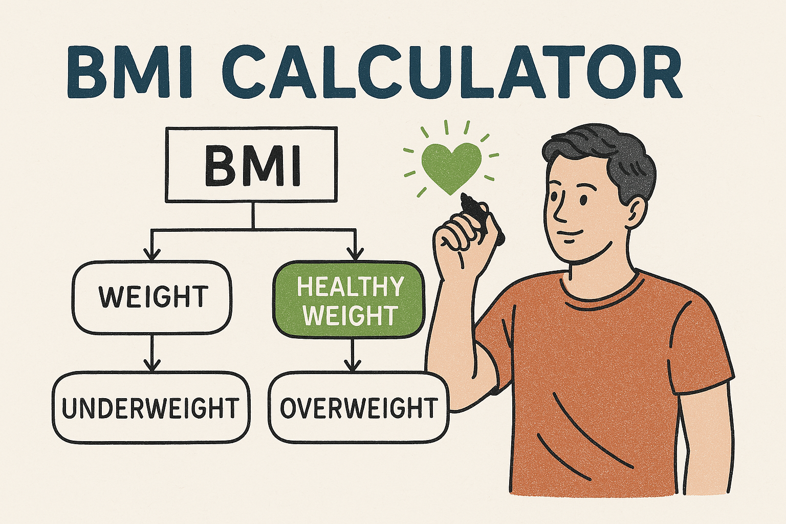

# 🧬 Segmentação de Pacientes por IMC



---

## 🧠 Sobre o Projeto

### ➤ O que é o projeto?

Este projeto realiza uma segmentação estratégica de pacientes a partir de um conjunto de dados clínicos, com foco na população com mais de 50 anos. O objetivo é identificar, de forma automatizada, pacientes com perfil de obesidade com base no índice de massa corpórea (IMC), categorizando-os como "normal" ou "obeso". O resultado é um conjunto de dados enriquecido e pronto para ser utilizado em análises preditivas ou programas de intervenção médica.

---

### ➤ Qual problema resolve?

Em cenários de saúde populacional e medicina preventiva, é fundamental identificar grupos de risco de forma eficiente. Este projeto resolve o problema de classificação inicial de pacientes com base em critérios objetivos, como idade e IMC, viabilizando a construção de modelos preditivos ou o direcionamento de ações específicas, como campanhas de prevenção ao diabetes tipo 2. A entrega de um dataset qualificado acelera etapas posteriores da análise, promovendo maior agilidade na tomada de decisão por parte das equipes clínicas ou de ciência de dados.

---

### ➤ Quais tecnologias foram usadas?

- **Python**: Para ingestão, processamento e exportação de dados.
- **SQL**: Para transformação eficiente dos dados diretamente no banco relacional, com foco em performance e escalabilidade.
- **Banco de Dados Relacional**: Utilizado para armazenar os dados temporariamente e aplicar operações de filtragem e enriquecimento de forma estruturada.

---

## 🛠️ Como executar localmente

1. Clone o repositório:

```bash
git clone https://github.com/diipdata/patient_segmentation_bmi.git
cd seu-repo
```

2. Instale as dependências com o Poetry:

```bash
poetry install
```

3. Execute o script principal:

```bash
poetry run jupyter notebook notebooks/patient_segmentation_bmi.ipynb
```

---


 ### 📊 Entregáveis
- Dataset filtrado com pacientes acima de 50 anos.

- Coluna adicional classificando IMC como “normal” ou “obeso”.

- Arquivo final exportado em formato .csv.

---

 ### 👨‍⚕️ Aplicações Potenciais
- Análises preditivas em saúde pública.

- Programas de monitoramento de doenças crônicas.

- Segmentação de pacientes para campanhas de prevenção.

---

 ### 👨‍💻 Autor
Feito por @diipdata

Entre em contato: diegop.freitas@gmail.com

[def]: images/cover_project.png